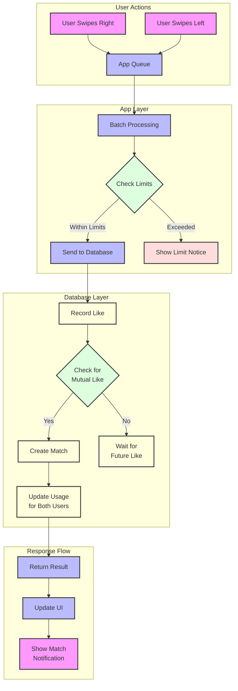
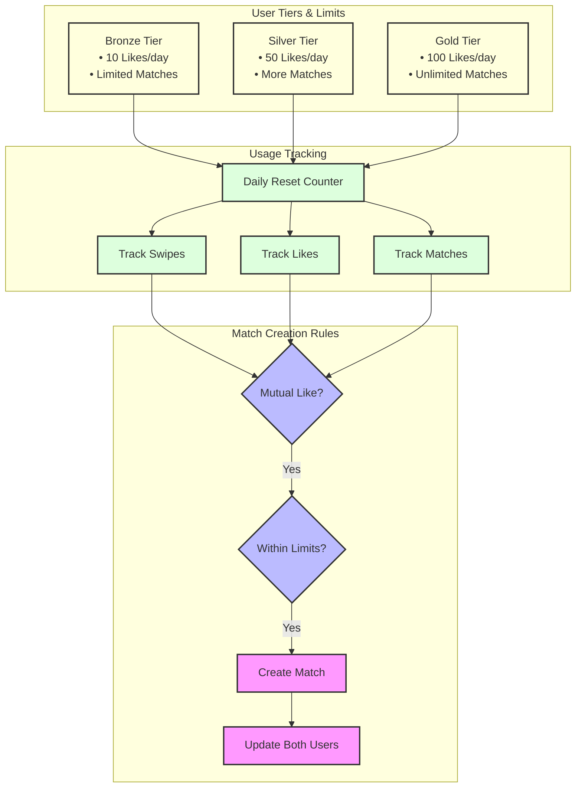
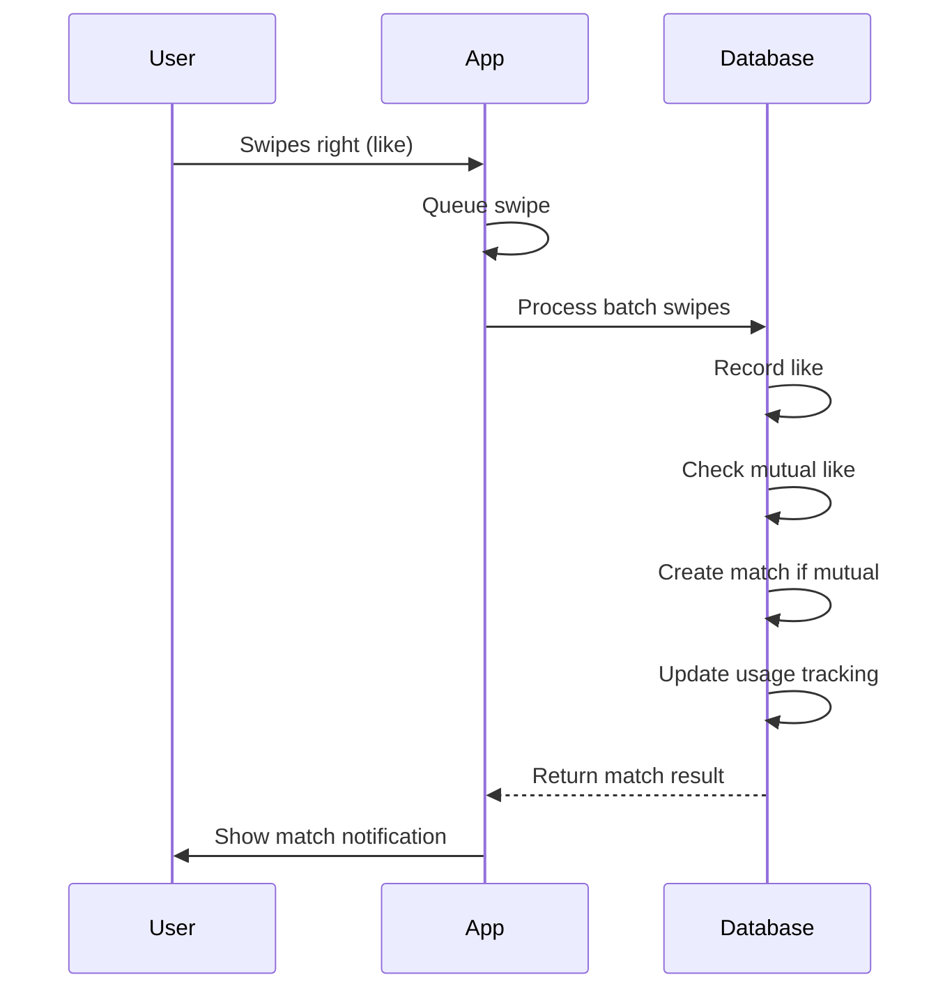

# Likes and Matches System Flow

## Quick Visual Overview

### Complete Flow

### Limits and Tracking System

## System Overview
The likes and matches system operates through a combination of app-side queueing and database-side processing. This design ensures efficient handling of user interactions while maintaining proper limits and creating matches when appropriate.

## Sequence Flow

## Component Details

### App-side (matches-store.ts)
- Uses batch processing for likes/swipes
- Queues swipes and processes them in batches
- Checks limits before allowing likes/matches
- Tracks pending likes in a Set
- Updates UI state for matches

### Database-side
- Trigger function `create_match_from_mutual_like`:
  - Checks for mutual likes
  - Checks both users' match limits
  - Creates match record
  - Updates usage tracking for both users

### Key Features
1. **Batch Processing**
   - Swipes are queued and processed in batches
   - Reduces database load
   - More efficient than processing each swipe individually

2. **Usage Tracking**
   - Tracks daily limits for:
     - Swipes
     - Likes
     - Matches
   - Different limits based on user tier
   - Updates in real-time

3. **Match Creation**
   - Automatic match creation on mutual likes
   - Respects both users' daily match limits
   - Updates both users' usage tracking
   - Triggers UI notifications

4. **Error Handling**
   - Handles limit exceeded cases
   - Manages network errors
   - Provides user feedback
   - Maintains data consistency

## Database Tables
- `likes`: Records user likes
- `matches`: Stores mutual matches
- `user_daily_usage`: Tracks usage limits

## Related Files
- `matches-store.ts`: App-side state management
- `functions.sql`: Database functions
- `schema.sql`: Table definitions
- `triggers.sql`: Database triggers 